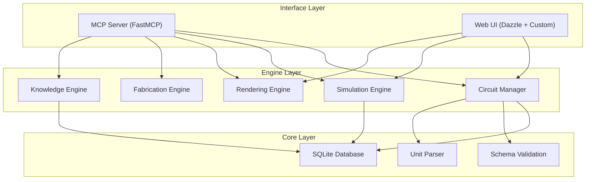

# Architecture

## Overview

ElectronicsMCP follows a layered architecture with independent engine modules and thin interface layers.

## Layers

### Core Layer

Pure Python with no framework dependencies:

- **Database** (`core/database.py`) -- SQLite connection management, schema initialization
- **Schema** (`core/schema.py`) -- Pydantic models for circuit JSON validation
- **Units** (`core/units.py`) -- EE unit parsing and formatting
- **Circuit Manager** (`core/circuit_manager.py`) -- CRUD, versioning, netlist generation

### Engine Layer

Independent modules that take Python objects in and return Python objects out. No MCP or web dependencies.

- **Simulation** -- PySpice (numerical) + lcapy (symbolic)
- **Rendering** -- schemdraw (schematics) + matplotlib (plots) + weasyprint (PDF)
- **Fabrication** -- netlist export, BOM generation, component matching
- **Knowledge** -- FTS search, topology explanation, design guides

### Interface Layer

Thin wrappers over the engine layer:

- **MCP Server** -- FastMCP tool definitions that parse inputs, call engines, format results for LLM consumption
- **Web UI** -- Dazzle for CRUD views + custom FastAPI routes for interactive features

## Key Design Decisions

1. **Engines are framework-agnostic** -- testable without MCP or web server
2. **SQLite is project-scoped** -- each project directory has its own `data/ee.db`
3. **File-based outputs** -- schematics, plots, reports written to `output/` for Claude Code to present
4. **Offline-first** -- fully functional without network access
5. **Dual interaction model** -- conversational (MCP) and interactive (web UI) share the same database
