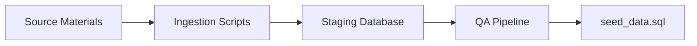

# Seed Data Strategy

The database is initialized with curated seed data sourced from openly licensed corpora.

## Sources

| Source | Licence | Content |
|--------|---------|---------|
| Kuphaldt "Lessons in Electric Circuits" | Design Science License | ~185 knowledge articles, ~80 formulas |
| Ngspice bundled models | BSD-equivalent | ~50 SPICE models (diodes, BJTs, MOSFETs, op-amps) |
| KiCad symbol libraries | CC BY-SA 4.0 | Component metadata, pin definitions, footprint references |
| Authored content | Project licence | ~50 subcircuit definitions, ~30 design rules |

## Ingestion Pipeline

Scripts in `electronics_mcp/ingestion/`:

- `ingest_kuphaldt.py` -- Parse HTML volumes into structured knowledge articles
- `ingest_spice_models.py` -- Parse `.lib`/`.model` files into component_models
- `ingest_kicad_symbols.py` -- Parse `.kicad_sym` S-expressions
- `build_subcircuits.py` -- Validate authored subcircuit JSON definitions
- `build_design_rules.py` -- Process authored Markdown design rules
- `build_formulas.py` -- Combine extracted and authored formulas

## Provenance Tracking

Every seeded record has an entry in the `provenance` table tracking source name, URL, licence, and original path. This ensures licence compliance is verifiable.
