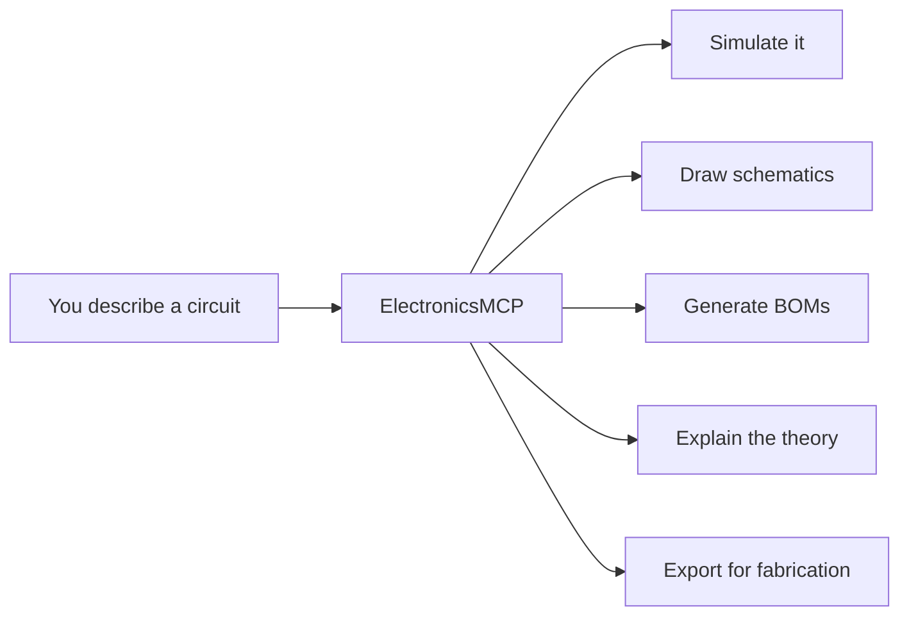

# ElectronicsMCP

**An MCP server providing electronic engineering context and skills to LLM agents.**

ElectronicsMCP bridges the gap between what LLMs *know* about electronics and what they can *do*. It provides tools for circuit modeling, SPICE simulation, symbolic analysis, schematic rendering, fabrication output, and a persistent knowledge base -- all accessible via the Model Context Protocol.

## What It Does

- **Model** -- Define circuits as structured JSON, persist across sessions
- **Simulate** -- Run SPICE numerical analysis and symbolic Laplace-domain analysis
- **Render** -- Generate publication-quality schematics, Bode plots, waveforms
- **Verify** -- Check circuit validity, cross-reference simulation against design intent
- **Educate** -- Query a knowledge base of EE fundamentals, formulas, and design rules
- **Fabricate** -- Export SPICE/KiCad netlists, generate BOMs with real component suggestions
- **Explore** -- Interactive web UI for parameter sweeps and circuit comparison

## Who It's For

| Persona | Use Case |
|---------|----------|
| **Student** | Learn fundamentals with clear schematics, step-by-step analysis, "what if I change R2?" |
| **Practitioner** | Design real circuits with accurate simulation, component selection, exportable artifacts |
| **Hobbyist/Maker** | Breadboard prototyping with practical guidance, circuit patterns, BOM generation |

## Quick Example

Ask your LLM agent:

> "Design me an RC low-pass filter with a 1kHz cutoff frequency"

The agent will:

1. Call `define_circuit` to create the circuit in the database
2. Call `ac_analysis` to compute the frequency response
3. Call `draw_schematic` to produce an SVG schematic
4. Call `draw_bode` to plot the Bode diagram
5. Call `check_design` to verify the cutoff meets the spec
6. Call `generate_report` to produce a complete design document

All outputs are files in your project directory that Claude Code presents natively.

## Getting Started

- [Installation](getting-started/installation.md) -- Install ElectronicsMCP and its dependencies
- [Quick Start](getting-started/quickstart.md) -- Your first circuit in 5 minutes
- [Configuration](getting-started/configuration.md) -- `.mcp.json` setup for Claude Code
